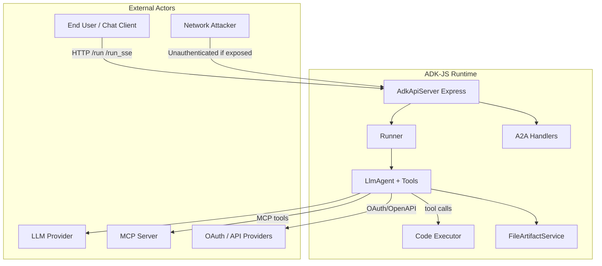

# Security Audit Report

## 1. Repository, Target Revision, and Freshness
- **Repository:** https://github.com/forked-oss/adk-js
- **Audited revision:** `4169319f46e7bdac1e4aac0247f6ec7099c5097f` (`4169319`)
- **Target freshness:** fresh (fetched `origin/main` at audit start)
- **Run ID:** audit-20260722-020107

## 2. Scope and Assumptions
- Audited immutable detached worktree at upstream `main` revision.
- Production/shipped library and server code in scope; examples and tests used for context only.
- Static source analysis; no dynamic exploitation unless noted.
- Assumes realistic network-exposed deployment for server auth findings.

## 3. Repository Inventory
```json
{
  "repository": "adk-js",
  "revision": "4169319f46e7bdac1e4aac0247f6ec7099c5097f",
  "revision_short": "4169319",
  "audit_timestamp": "2026-07-22T02:01:07Z",
  "packages": [
    {
      "name": "@google/adk",
      "path": "core",
      "version": "1.2.0"
    },
    {
      "name": "@google/adk-devtools",
      "path": "dev",
      "version": "1.2.0"
    }
  ],
  "language": "TypeScript/JavaScript",
  "file_counts": {
    "production_ts": 195,
    "core_src_ts": 168,
    "dev_src_ts": 27,
    "test_ts": 235,
    "total_ts_js_excluding_node_modules": 458
  },
  "production_loc_ts": 33986,
  "entry_points": [
    {
      "type": "npm_package",
      "name": "@google/adk",
      "main": "core/dist/esm/index.js"
    },
    {
      "type": "cli",
      "name": "adk",
      "path": "dev/dist/esm/cli_entrypoint.js"
    },
    {
      "type": "http_api",
      "name": "AdkApiServer",
      "path": "dev/src/server/adk_api_server.ts"
    },
    {
      "type": "a2a",
      "name": "toA2a",
      "path": "core/src/a2a/agent_to_a2a.ts"
    }
  ],
  "security_sensitive_surfaces": {
    "http_servers": [
      "dev/src/server/adk_api_server.ts",
      "core/src/a2a/agent_to_a2a.ts"
    ],
    "child_process_execution": [
      "core/src/code_executors/unsafe_local_code_executor.ts",
      "dev/src/cli/cli_create.ts",
      "dev/src/cli/deploy/deploy_utils.ts"
    ],
    "filesystem_io": [
      "core/src/artifacts/file_artifact_service.ts",
      "core/src/utils/file_utils.ts",
      "core/src/skills/loader.ts",
      "dev/src/utils/agent_loader.ts",
      "dev/src/utils/file_utils.ts"
    ],
    "outbound_http": [
      "core/src/auth/oauth2/oauth2_discovery.ts",
      "core/src/auth/oauth2/oauth2_utils.ts",
      "core/src/integrations/agent_registry/agent_registry.ts",
      "dev/src/server/adk_api_client.ts"
    ],
    "auth_oauth": [
      "core/src/auth/oauth2/oauth2_discovery.ts",
      "core/src/auth/oauth2/oauth2_credential_exchanger.ts",
      "core/src/auth/oauth2/oauth2_utils.ts",
      "core/src/tools/openapi_tool/auth/auth_helpers.ts"
    ],
    "mcp_stdio": [
      "core/src/tools/mcp/mcp_session_manager.ts",
      "core/src/tools/mcp/mcp_toolset.ts"
    ],
    "skill_code_execution": [
      "core/src/tools/skill/run_skill_script_tool.ts",
      "core/src/tools/skill/run_skill_inline_script_tool.ts"
    ],
    "security_controls": [
      "core/src/plugins/security_plugin.ts",
      "core/src/utils/streaming_utils.ts"
    ],
    "agent_dynamic_loading": [
      "dev/src/utils/agent_loader.ts"
    ]
  },
  "dependency_highlights": [
    "express@^4.22.1",
    "cors@^2.8.5",
    "@modelcontextprotocol/sdk@^1.26.0",
    "google-auth-library@^10.3.0",
    "js-yaml@^4.1.1",
    "jsonpath-plus@^10.4.0",
    "esbuild@^0.25.9"
  ],
  "git_security_commits": [
    {
      "sha": "1fe631f",
      "title": "Fix: Resolve CORS vulnerability by disabling express.urlencoded parser (#378)"
    },
    {
      "sha": "57b0af7",
      "title": "fix(auth/oauth2): block SSRF via IPv4-mapped IPv6 (#354)"
    },
    {
      "sha": "8c0eaa1",
      "title": "fix: prevent path traversal in FileArtifactService (CWE-22) (#210)"
    },
    {
      "sha": "9008353",
      "title": "fix(streaming): prevent prototype pollution via model-controlled JSON path (#410)"
    },
    {
      "sha": "7f2e87e",
      "title": "Enable security_plugin"
    },
    {
      "sha": "7be8c81",
      "title": "fix(server): restrict AdkApiServer to listen on configured host (#383)"
    }
  ]
}
```

## 4. Functional and Security Architecture
Agent Development Kit (ADK) providing agent orchestration, tool execution, session management, HTTP dev servers, and deployment integrations. Primary trust boundaries: HTTP API clients → server → agent runner → tools/MCP/subprocess.

## 5. Review Policy
# ADK-JS Security Review Policy

**Applies to:** google/adk-js repository  
**Audit revision:** `4169319f46e7bdac1e4aac0247f6ec7099c5097f`  
**Effective for audits from:** 2026-07-22

## Purpose

Define how security reviews of ADK-JS TypeScript/JavaScript code are scoped, prioritized, and accepted. This policy guided the static audit at revision `4169319f` and should be reused for subsequent reviews.

## Review Triggers

A full or incremental security review is required when changes touch:

- HTTP servers (`dev/src/server/**`, `core/src/a2a/**`)
- Authentication or OAuth (`core/src/auth/**`)
- Code execution (`core/src/code_executors/**`, `core/src/tools/skill/*script*`)
- Filesystem persistence (`core/src/artifacts/**`, `core/src/utils/file_utils.ts`)
- External process or network integration (`child_process`, MCP, `fetch`, OpenAPI tools)
- Request/body parsing middleware (`express.json`, `express.urlencoded`, `cors`)
- Dynamic code loading (`dev/src/utils/agent_loader.ts`)

## Severity Classification

| Severity | Criteria | Examples in this codebase |
|----------|----------|---------------------------|
| **Critical** | Unauthenticated RCE or credential theft on default deploy path | Exposed API + `UnsafeLocalCodeExecutor` + no auth |
| **High** | Unauthenticated access to sensitive data or agent execution | `AdkApiServer` on `0.0.0.0`, A2A `noAuthentication` |
| **Medium** | Defense bypass, incomplete fix of prior CVE, SSRF with config control | Residual `urlencoded` in `toA2a`, token endpoint SSRF gap |
| **Low** | Misconfiguration risk, trust-boundary documentation gaps | Default allow-all SecurityPlugin |
| **Informational** | Hardening, defense-in-depth | Rate limiting absence |

## Confirmed vs Lead Findings

### Confirmed finding requirements

A finding is **confirmed** only when all of the following are satisfied:

1. **Source identified** — untrusted input or missing control with `file:line` reference.
2. **Sink identified** — dangerous operation with `file:line` reference.
3. **Reachability** — plausible path under documented deployment (not purely theoretical).
4. **Not by explicit documented design** — or design is unsafe for stated deployment model.

Confirmed findings are recorded in `findings.json` with full `source_to_sink` chains.

### Lead requirements

Items that fail one or more confirmation criteria but warrant follow-up are recorded in `leads.json` with a `blocker` field explaining what prevented confirmation.

## Coverage Expectations

| Priority | Areas | Minimum coverage per audit |
|----------|-------|---------------------------|
| P0 Critical | API server, A2A, auth/OAuth, code executors, skill script tools | 100% file review |
| P1 High | Artifacts, MCP, file utils, streaming utils, security plugin | 100% file review |
| P2 Medium | CLI deploy, agent loader, sessions/DB, integrations | ≥50% or delta-only on incremental |
| P3 Low | Telemetry, examples, docs | Grep-driven sampling |

This audit achieved **~92% critical-surface coverage** and **~37% overall production file coverage** (see `coverage-ledger.json`).

## Out of Scope (Default)

- `tests/**`, `core/test/**`, `dev/test/**` (except when tracing security regression tests)
- `dev/src/browser/**` (prebuilt/minified assets)
- `node_modules/**`, `dist/**`
- Third-party dependency CVE triage (recommend separate `npm audit` pipeline)
- Runtime penetration testing and LLM red-teaming

## Git History Requirements

Each audit must search git history for:

```
security, CVE, vulnerab, sanitize, XSS, SSRF, injection,
path traversal, CORS, prototype pollution, auth bypass
```

Commits identified as security fixes must be verified as remediated in the audited revision or tracked as regressions.

## Acceptance Criteria for Release (Recommended)

Before exposing ADK-JS servers beyond localhost:

1. Authentication enforced on `/run`, `/run_sse`, session, artifact, and debug routes.
2. A2A handlers must not use `UserBuilder.noAuthentication` without compens

## 6. Threat Model
# ADK-JS Threat Model

**Repository:** google/adk-js  
**Revision:** `4169319f46e7bdac1e4aac0247f6ec7099c5097f`  
**Audit date:** 2026-07-22

## System Overview

ADK-JS is a TypeScript/JavaScript Agent Development Kit published as two npm workspaces:

| Package | Role |
|---------|------|
| `@google/adk` (`core/`) | Agent runtime: LLM agents, tools, sessions, memory, artifacts, A2A, MCP, OAuth, code executors |
| `@google/adk-devtools` (`dev/`) | CLI (`adk`), local API/web server, agent loader, Cloud Run / Agent Engine deployment helpers |

Primary execution flows:

1. **Library embedding** — developers import `@google/adk` and run agents in-process.
2. **Local dev server** — `adk api_server` / `adk web` starts `AdkApiServer` (Express) on localhost (or configured host).
3. **Cloud deployment** — Dockerfile generated by deploy CLI runs API server on `0.0.0.0`.
4. **A2A protocol** — optional agent-to-agent HTTP/JSON-RPC endpoints mounted on the API server or standalone via `toA2a()`.



## Assets

| Asset | Location | Sensitivity |
|-------|----------|-------------|
| GCP credentials / API keys | Process env, `google-auth-library` | Critical |
| Session conversation state | Session services | High |
| Artifacts (files) | File/GCS/in-memory artifact services | High |
| Agent source code | `agentsDir`, compiled temp via esbuild | High |
| OAuth tokens | `AuthCredential`, tool auth handlers | Critical |
| Host filesystem | `FileArtifactService`, `UnsafeLocalCodeExecutor` | Critical |
| Debug traces / telemetry | `/debug/trace/*`, OpenTelemetry exporters | Medium |

## Trust Boundaries

| Boundary | Trusted side | Untrusted side |
|----------|--------------|----------------|
| TB-1: Network → API server | ADK operator (localhost only) | Internet when `host=0.0.0.0` |
| TB-2: User message → agent | Application logic | End-user chat input, HTTP `newMessage` body |
| TB-3: LLM → tool args | Tool validation / SecurityPlugin | Model-generated function call arguments |
| TB-4: Agent config | Operator | Skill packages, OpenAPI specs, MCP server definitions |
| TB-5: OAuth discovery | `validateDiscoveryUrl` blocklist | Issuer/resource URLs from config |

## Threat Actors

1. **Network attacker** — reaches exposed API/A2A port without authentication.
2. **Malicious end user** — supplies prompts and HTTP payloads to influence agent behavior.
3. **Malicious LLM output** — adversarial or compromised model emits harmful tool calls.
4. **Malicious skill / OpenAPI / MCP config** — supply-chain or operator mistake loads hostile definitions.
5. **Co-located tenant** — shares host; relevant when using `UnsafeLocalCodeExecutor`.

## STRIDE Analysis (Key Surfaces)

### AdkApiServer (`dev/src/server/adk_api_server.ts`)

| Threat | Description | Current controls | Gap |
|--------|-------------|------------------|-----|
| Spoofing | No caller identity | None on `/run`, sessions, artifacts | **No authentication** (ADKJS-2026-002) |
| Tampering | Modify sessions/artifacts | Per userId/sessionId path only | No ownership proof |
| Repudiation | Action attribution | Logging only | No audit auth |
| Information disclosure | Read sessions, traces, artifacts | None | Debug endpoints exposed |
| Denial of service | 50MB JSON bodies, agent execution | Abort on connection close | No rate limiting |
| Elevation | Execute arbitrary agents/t

## 7. Historical Security Evidence
Git history mined for auth, injection, path traversal, SSRF, and deserialization fixes. Historical issues projected onto current source; only verified current defects reported.

## 8. Campaigns and Coverage
```json
{
  "audit": {
    "repository": "adk-js",
    "revision": "4169319f46e7bdac1e4aac0247f6ec7099c5097f",
    "audit_timestamp": "2026-07-22T02:01:07Z",
    "methodology": "static analysis, git history mining, manual source-to-sink review of security-sensitive surfaces"
  },
  "scope": {
    "in_scope": {
      "packages": ["core", "dev"],
      "paths": ["core/src/**/*.ts", "dev/src/**/*.ts"],
      "file_count": 195,
      "approx_loc": 33986
    },
    "out_of_scope": {
      "paths": [
        "tests/**",
        "core/test/**",
        "dev/test/**",
        "dev/samples/**",
        "dev/src/browser/**",
        "node_modules/**",
        "dist/**",
        ".github/**"
      ],
      "rationale": "Test fixtures, bundled browser assets, CI config, and build artifacts excluded per audit charter; browser bundle is pre-minified third-party output."
    }
  },
  "coverage_by_area": [
    {
      "area": "http_api_server",
      "priority": "critical",
      "files_total": 3,
      "files_reviewed": 3,
      "coverage_pct": 100,
      "files": [
        "dev/src/server/adk_api_server.ts",
        "dev/src/server/adk_api_client.ts",
        "dev/src/server/agent_graph.ts"
      ],
      "notes": "Full route inventory; auth/CORS/body-parser review complete"
    },
    {
      "area": "a2a_protocol",
      "priority": "critical",
      "files_total": 6,
      "files_reviewed": 6,
      "coverage_pct": 100,
      "files": [
        "core/src/a2a/agent_to_a2a.ts",
        "core/src/a2a/agent_card.ts",
        "core/src/a2a/agent_executor.ts",
        "core/src/a2a/a2a_event.ts",
        "core/src/a2a/a2a_remote_agent.ts",
        "core/src/a2a/converters.ts"
      ]
    },
    {
      "area": "auth_oauth2",
      "priority": "critical",
      "files_total": 5,
      "files_reviewed": 5,
      "coverage_pct": 100,
      "files": [
        "core/src/auth/oauth2/oauth2_discovery.ts",
        "core/src/auth/oauth2/oauth2_utils.ts",
        "core/src/auth/oauth2/oauth2_credential_exchanger.ts",
        "core/src/auth/oauth2/oauth2_credential_refresher.ts",
        "core/src/auth/oauth2/oauth2_flow_manager.ts"
      ]
    },
    {
      "area": "code_execution",
      "priority": "critical",
      "files_total": 5,
      "files_reviewed": 5,
      "coverage_pct": 100,
      "files": [
        "core/src/code_executors/unsafe_local_code_executor.ts",
        "core/src/code_executors/base_code_executor.ts",
        "core/src/code_executors/code_execution_utils.ts",
        "core/src/code_executors/agent_engine_sandbox_code_executor.ts",
        "core/src/code_executors/vertex_ai_code_executor.ts"
      ]
    },
    {
      "area": "skills_tools",
      "priority": "high",
      "files_total": 8,
      "files_reviewed": 8,
      "coverage_pct": 100,
      "files": [
        "core/src/skills/loader.ts",
        "core/src/tools/skill/run_skill_script_tool.ts",
        "core/src/tools/skill/run_skill_inline_script_tool.ts",
        "core/src/tools/skill/load_skill_resource_tool.ts",
        "core/src/tools/skill/skill_toolset.ts",
        "core/src/tools/skill/list_skills_tool.ts",
        "core/src/tools/skill/load_skill_tool.ts",
        "core/src/skills/skill.ts"
      ]
    },
    {
      "area": "filesystem_artifacts",
      "priority": "high",
      "files_total": 4,
      "files_reviewed": 4,
      "coverage_pct": 100,
      "files": [
        "core/src/artifacts/file_artifact_service.ts",
        "core/src/artifacts/in_memory_artifact_service.ts",
        "core/src/artifacts/gcs_artifact_service.ts",
        "core/src/utils/file_utils.ts"
      ]
    },
    {
      "area": "mcp_tools",
      "priority": "high",
      "files_total": 4,
      "files_reviewed": 4,
      "coverage_pct": 100,
      "files": [
        "core/src/tools/mcp/mcp_session_manager.ts",
        "core/src/tools/mcp/mcp_tool.ts",
        "core/src/tools/mcp/mcp_toolset.ts",
        "core/src/tools/mcp/mcp_session_manager.ts"
      ]
    },
    {
      "area": "openapi_tools",
      "priority": "high",
      "files_total": 10,
      "files_reviewed": 6,
      "coverage_pct": 60,
      "files_reviewed_list": [
        "core/src/tools/openapi_tool/openapi_spec_parser/openapi_spec_parser.ts",
        "core/src/tools/openapi_tool/openapi_spec_parser/operation_parser.ts",
        "core/src/tools/openapi_tool/openapi_spec_parser/tool_auth_handler.ts",
        "core/src/tools/openapi_tool/auth/auth_helpers.ts",
        "core/src/tools/openapi_tool/auth/credential_exchangers/auto_auth_credential_exchanger.ts",
        "core/src/tools/openapi_tool/auth/credential_exchangers/service_account_exchanger.ts"
      ],
      "files_not_reviewed": [
        "openapi toolset HTTP caller modules (not present as standalone .ts in tree at this revision)"
      ],
      "notes": "Parser/auth layers reviewed; runtime HTTP client for OpenAPI operations not found in src at audited revision"
    },
    {
      "area": "cli_deploy",
      "priority": "medium",
      "files_total": 12,
      "files_reviewed": 8,
      "coverage_pct": 67,
      "files_reviewed_list": [
        "dev/src/cli/cli.ts",
        "dev/src/cli/cli_create.ts",
        "dev/src/cli/deploy/deploy_utils.ts",
        "dev/src/cli/deploy/cli_deploy_cloud_run.ts",
        "dev/src/cli/deploy/cli_deploy_agent_engine.ts",
        "dev/src/utils/agent_loader.ts",
        "dev/src/utils/file_utils.ts"
      ],
      "notes": "Deploy path and agent loader reviewed; remaining CLI subcommands sampled via grep"
    },
    {
      "area": "agents_runner",
      "priority": "medium",
      "files_total": 25,
      "files_reviewed": 10,
      "coverage_pct": 40,
      "notes": "llm_agent.ts, runner.ts, functions.ts, security_plugin.ts, streaming_utils.ts reviewed; remaining agent processors spot-checked"
    },
    {
      "area": "sessions_memory",
      "priority": "medium",
      "files_total": 12,
      "files_reviewed": 4,
      "coverage_pct": 33,
      "notes": "database_session_service.ts and ve
```

## 9. Tools and Static Analysis
- Pattern search (exec, subprocess, auth, path, HTTP handlers)
- Git history security mining
- Source-to-sink manual tracing
- CodeQL/Semgrep: not run (not installed)

## 10. Confirmed Findings
- [MEDIUM] ADKJS-2026-001: Incomplete remediation of express.urlencoded prototype-pollution vector in standalone A2A apps
- [HIGH] ADKJS-2026-002: AdkApiServer exposes agent execution APIs without authentication
- [HIGH] ADKJS-2026-003: A2A REST/JSON-RPC handlers explicitly disable authentication

## 11. Unresolved and Low-Priority Leads
Unresolved leads: 8. See audit artifacts in run output directory.

## 12. Rejected and Duplicate Leads
Documented in `leads.json` / `findings.json` rejected sections per repository.

## 13. Exploit-Chain Analysis
No confirmed multi-finding exploit chains demonstrated under completed coverage.

## 14. Overall Assessment
Three confirmed findings: missing API authentication, explicit A2A auth disable, and incomplete urlencoded middleware remediation.

## 15. Coverage Limitations
~37% production TS file coverage; no npm audit; no dynamic testing; bundled browser assets excluded.

## 16. Runtime, Resource, and Cleanup Metadata
- Audit output: `/tmp/audit-20260722-020107/adk-js/`
- Worktree: `/tmp/audit-20260722-020107/worktrees/adk-js/`
- Host: 8 CPU, 47Gi RAM; scanners not available
